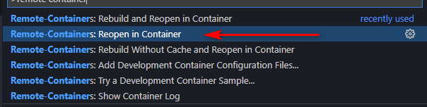
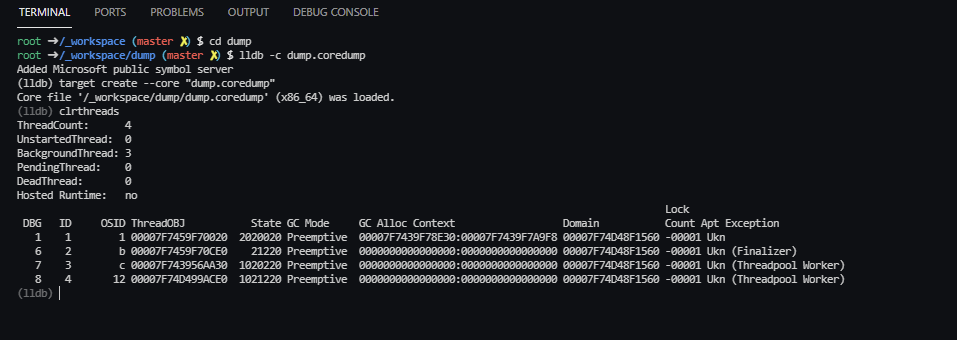
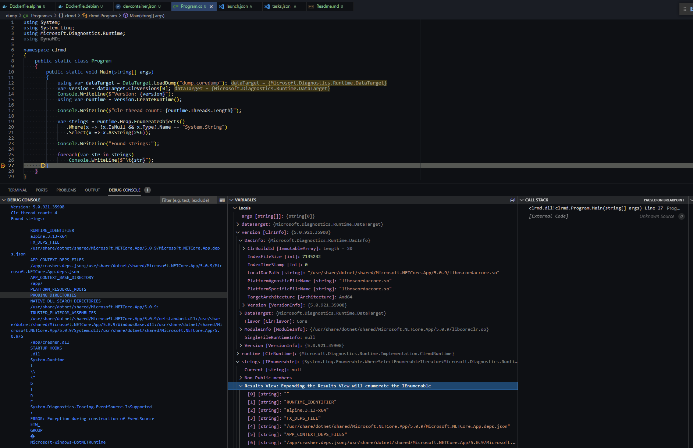
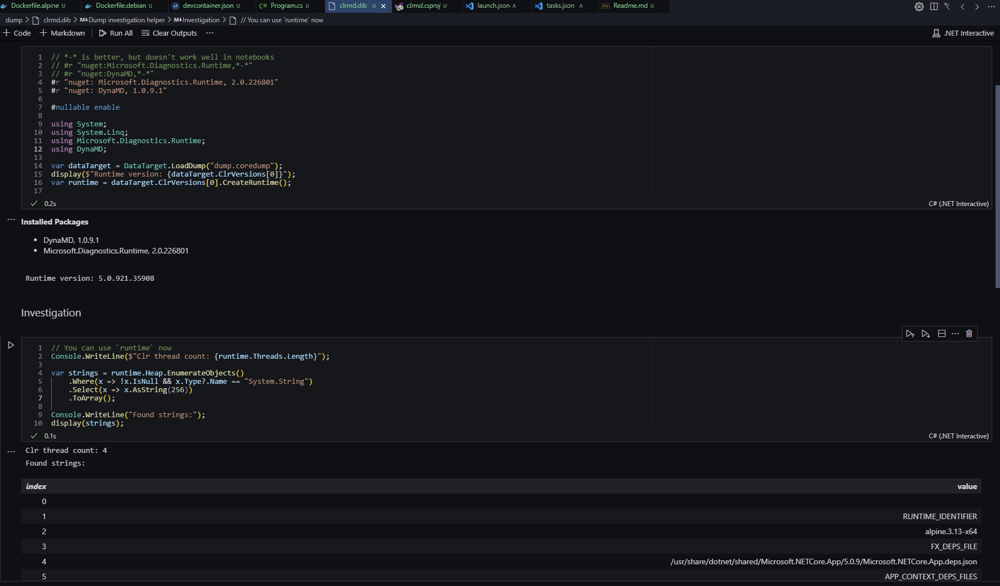
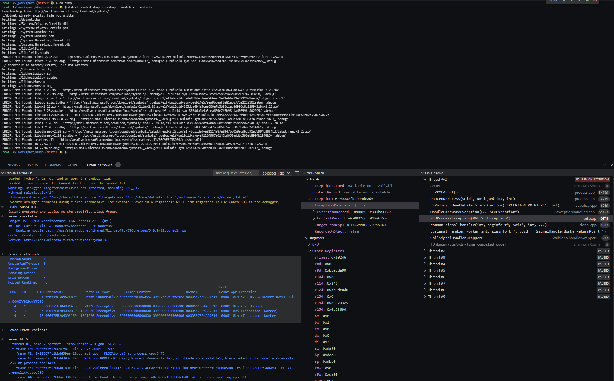
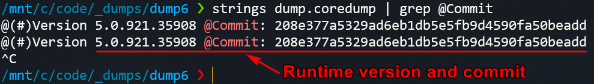
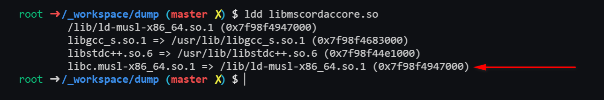

# dotnet-dumps-devcontainer

The repo contains dotnet coredump investigation helpers. Supports alpine/debian/ubuntu based coredumps.

## How to use

1. Open the repository folder with [Visual Studio Code](https://code.visualstudio.com/) ;
2. Install workspace recommended extensions ;
3. Place your dump to `dump/` with filename `dump.coredump` ;
4. Edit [`.devcontainer/devcontainer.json`](.devcontainer/devcontainer.json) file

    * If your dump were collected from Debian-based (ubuntu/debian/etc) OS change the `dockerfile` property to `Dockerfile.debian` or to `Dockerfile.alpine` for dumps from Alpine.
    * Change the value of `DOTNET_SDK_IMAGE_TAG` in `args` section to the coresponding docker image tag of dotnet sdk. Note that runtime version != sdk version. From a dump you can get only runtime version. It's described in [FAQ](#how-can-i-find-out-the-runtime-version-from-the-dump)
5. Use `Reopen in Container`  

      

### Folder structure

* `/_workspace` - current dir. repo root.
* `/_symbols` - additional symbols for lldb,is mounted from local `_symbols`
* `/src` the folder where you can place sources of the dumped application. lldb maps sources from `/_workspace/src` to `/src` and `/app` automatically.
* `/_nupkg` - nuget cache folder, is mounted from `~/.nuget/packages`
* `/_workspace/dump` might contain `dump.coredump` file. The startup script automatically download DAC for this file. It also contains dotnet `clrmd.csproj` and `clrmd.dib` (dotnet notebook), that can be useful in dump investigating.   

### Run lldb

```bash
cd dump
lldb --core dump.coredump ./dotnet
```

  

After that you can use sos commands in the lldb prompt.


### ClrMD / Microsoft.Diagnostics.Runtime

You can write your own debugging logic with [ClrMD (aka `Microsoft.Diagnostics.Runtime`)](https://github.com/microsoft/clrmd).  

The project template is placed under the `dump` directory, so you can use it with `clrmd` debug target.  

  

Or you can use `dotnet interactive` for the same purpose, but with "hot reload" (because variables (e.g. loaded runtime) from cells are still in memory after execution, it helps a lot with visualization after grouping)

  

**Feel free to make PRs with your snippets for the notebook** :)

### Cheat sheets

* [SOS](https://docs.microsoft.com/en-us/dotnet/core/diagnostics/sos-debugging-extension)  
* [lldb](https://www.nesono.com/sites/default/files/lldb%20cheat%20sheet.pdf)
* [clrmd/src/Samples](https://github.com/microsoft/clrmd/tree/master/src/Samples)  
* [kevingosse/DynaMD](https://github.com/kevingosse/DynaMD)  

## How to run native code debugging with lldb-mi

You can use [Microsoft C++ extension](https://marketplace.visualstudio.com/items?itemName=ms-vscode.cpptools)
to debug the native part of coredump.  

### Installing lldb-mi

* Debian and Ubuntu use old lldb with lldb-mi on board, so no additional steps for these OS.
For this you should:  

* Alpine uses newer [lldb without lldb-mi](https://lists.llvm.org/pipermail/lldb-dev/2019-August/015357.html)  
So you should be able to compile your own [lldb-mi](https://github.com/lldb-tools/lldb-mi) for this.

### Run instructions

* uncomment `ms-vscode.cpptools` line in [`.devcontainer/devcontainer.json](./.devcontainer/devcontainer.json) or install the C++ extension inside devcontainer by youself;
* if you don't use `dump.coredump` name for your dump, change the `coreDumpPath` property in `.vscode/launch.json`
* you can load additional runtime symbols with command: `dotnet symbol dump.coredump --symbols --modules --overwrite`
* change run target under debug tab to `cppdbg-lldb` ;
* run `Debug` ;

You can use sos commands as usual from the vscode debug console with `-exec <sos_or_lldb_command>`.  



# FAQ

## How can I find out the runtime version from the dump?

You can use these linux commands (works fine from wsl, if you are on Windows)  

`strings dump.coredump | grep @Commit`  

  

## Where can I find the full list of dotnet sdk image tags?

[Here.](https://mcr.microsoft.com/v2/dotnet/sdk/tags/list)

## How can I verify that a coredump has been collected from Alpine/Debian/Other OS?

I don't know the 100% solution for that, but we can that a dump is an Alpine dump with musl.
Musl is a C standard library which is used by Alpine and it should be refereced from DAC.
Thus, after downloading the DAC (automatically for `dump/dump.coredump` or manually with `dotnet symbol {dumpPath} --debugging`) you can verify that libmusl is presented.

`ldd libmscordaccore.so`  

  

## How can I collect dump?

There are several ways to do it. The easiest way (and I think the only one that works on Docker on WSL 2) it's to use
`createdump` utility, which is provided with runtime. For example:

`/usr/share/dotnet/shared/Microsoft.NETCore.App/5.0.9/createdump --full -f /_workspace/dump/%t.coredump <PID>`  

AFAIK there are no easy ways to use it with automatically collected crash dumps and default crash dumps sometimes
couldn't be loaded. In that case you will see something like `CreateDacInstance failed 0x80131c4f` (in ClrMD or `logging enable` + lldb) or `Failed to load data access module, 0x80004002`). I recommend to set `coredump_filter` to `0xFF`. You can do it with [kernel loading params](https://stackoverflow.com/questions/36523279/coredump-filter-for-all-processes) or per process with: `echo 0xFF > /proc/<pid>/coredump_filter`. All child processes inherit the filter of the parent. So you can specify filters on all presented processes (on the k8s node for example) and after that, you don't need to setup the kernel loading params.

```bash
# sets coredump_filter for all current running processes
find /proc/ -name coredump_filter -exec sh -c 'echo 0xFF > {} || exit 0' \;
# verify that all processes have 0xFF filter now
find /proc/ -name coredump_filter -exec cat {} \;
```

after that all your containers on k8s node will have the 0xFF `coredump_filter`. You can do it from `privileged` container. Don't forget to specify `/proc/sys/kernel/core_pattern` to get dumps.

#### Yama
[Yama](https://www.kernel.org/doc/Documentation/security/Yama.txt) is a Linux Security Module, for `PTRACE_ATTACH` (attach to any other process running under the same uid) you may need to set to 0

```bash
echo 0 > /proc/sys/kernel/yama/ptrace_scope
```
